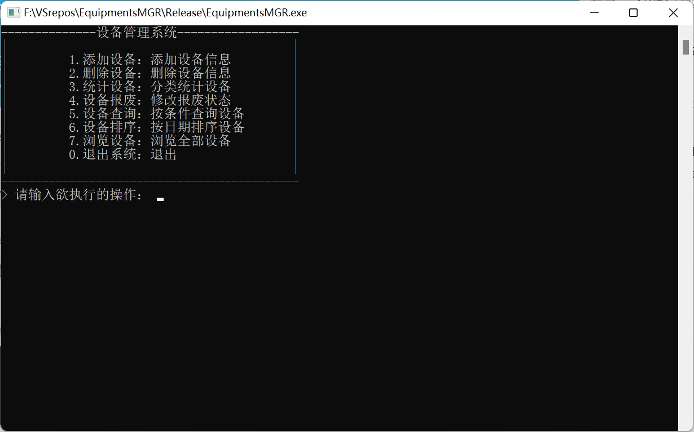

# EquipmentMGR 使用说明

## 项目&源码
EquipmentsMGR项目是缘于C语言小组课程设计而产生的、按照指导书给予的要求而设计补充并实现的一个用于简单管理设备信息的程序。

项目使用`Visual Studio 2019`和`Dev C++`开发，在项目根目录有vs项目文件"EquipmentsMGR.sln"，在源代码根目录有dev配置文件"EqupimentsMGR.dev",对应工具可以直接打开有关项目配置文件进行本地项目管理和开发。

开发者：[@ChaseOne1](https://github.com/ChaseOne1 "ChaseOne1's github")  
贡献者：[@ikun](https://github.com/ikun666123 "ikun666123's github") [@XLiu666233](https://github.com/ikun666123 "XLiu666233") [@black775825](https://github.com/black775825 "black775825") [@T-thinker](https://github.com/T-thinker "T-thinker")

## 程序使用

### 开始

1. 拖入文件启动
   1. 当拥有一个**规范**写入了设备信息的文件，您可以将其拖动至程序图标上使程序进行这些设备信息的录入(录入后程序将在您使用程序内置功能“删除设备信息”前一直保持管理这些数据)。等待程序录入外部数据完成后，程序将进入主界面。
2. 直接启动
    1. 直接双击程序打开，等待程序录入外部数据后，程序将进入主界面。

程序启动后，若同级目录下无`"Equipments_Info.txt"`文件，将自动创建用于储存设备数据。

>使用外部录入功能需要规范文件内信息的格式：每行写入一条设备信息，按照`设备种类 设备名称 设备编号 购入日期 报废日期 购入价格`格式写入，其中若设备未报废则“报废日期”处填写"0"。  
具体实例请参考"Resources"文件夹内的"data.txt"。

### 使用

主界面(菜单)
   

按照程序提示进行操作即可，设备信息数据将会保存在同级目录的`"Equipments_Info.txt"`内，**请勿随意修改**，否则将引起未知错误！